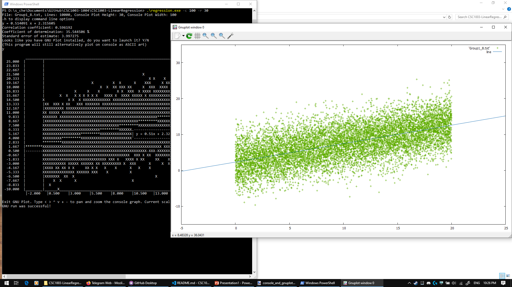
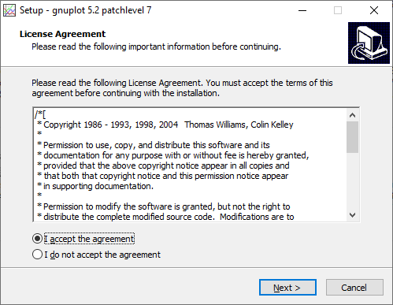
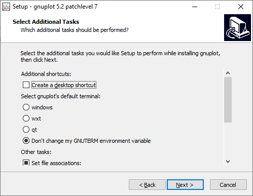
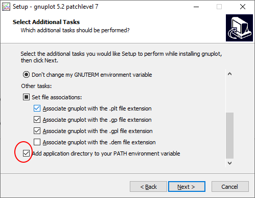
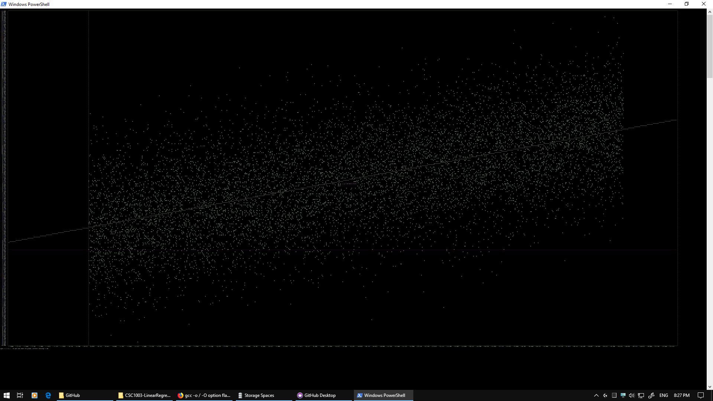

# Documentation CSC1003 Assignment 1
**__Linear Regression__**

## Problem Definition
1.	Open the dataset file and extract the respective observation data point (x1, y1), (x2, y2), (x3, y3)…(x10,000, y10,000) into array set.
2.	Write a function to perform a linear regression analysis and fits a straight line equation in the form of  y = mx + c to the set of observations (x1, y1), (x2, y2), (x3, y3)…(x10,000, y10,000). It should also compute the correlation coefficient, the coefficient of determination and the standard error of the estimate.
3.	The output program should plot the 10,000 points in the x, y plane and draw the estimated straight-line equation that will superimpose on these 10,000 points. The output program shall also print the results of the equation of the estimated straight line, correlation coefficient, coefficient of determination and standard error of the estimate.


## Problem Analysis


## Pseudo Code


## Source Code
This assignment is written in ANSI C(C89).  
All source files (`.c` `.h`) in `./src/` folder are originally written by the team.  
They contain the algorithms for calculating the regression line equation, file operations, plotting graph as ASCII art on the console as well as an optional feature to open and plot the graph on a additional program called [Gnuplot]("http://www.gnuplot.info/").

Main entry point: `regression.c`
## Dependencies
- C Standard Library
- C Maths Library
- unistd
- Gnuplot (Optional)

## Compiling
This is compiled and tested using GCC.  
Open terminal in this directory:   
> `gcc ./src/*.c -o regression -lm`

### Platforms Supported
- Windows
- MAC OS
- Raspbian (Raspberry PI)

## Operating the Program
The program by default requires a data input file of 10000 lines of comma seperated value tuple named `Group1_8.txt` (Assigned by the Lecturer) in the same directory as the regression executable.

### Executing the program with default configuration on command line
Run the executable in this directory:   
> `./regression`

#### Expected Output on Standard Out
```
File: Group1_8.txt, Lines: 10000, Console Plot Height: 20, Console Plot Width: 80
-h to display command line options
Min Y: -9.626100 , Max Y: 25.362000
y = 0.514091 x + 2.315605
Correlation coefficient: 0.596192
Coefficient of determination: 35.544506 %
Standard error of estimate: 3.996875
           _________________________________________________________________________________
  25.000  |      |                                                     X       XXX          |
  23.250  |      |                                                  X    X X  X  X          |
  21.500  |      |                                     X            XX      X   XX          |
  19.750  |      |                 X        X X     X    XXX  XXX XXX XXXXXXXXXXXX          |
  18.000  |      |            X       XX X  XXXX XX  X XXXXXXXXXXXXXXXXXXXXXXXXXXX          |
  16.250  |      |        X  X X XX X    XXXXX XXXXXXX XXXXXXXXXXXXXXXXXXXXXXXXXXX          |
  14.500  |      |XX  X X  XXXXX XXXXXXXXXXXXXXXXX XXXXXXXXXXXXXXXXXXXXXXXXXXXXXXX      *** |
  12.750  |      |XXXXXXXXXXXXXXXXXXXXXXXXXXXXXXXXXXXXXXXXXXXXXXXXXXXXXXXXXXX***********    |
  11.000  |      |XXXXXXXXXXXXXXXXXXXXXXXXXXXXXXXXXXXXXXXXXXXXXXXXX**********XXXXX          |
   9.250  |      XXXXXXXXXXXXXXXXXXXXXXXXXXXXXXXXXXXXXXX***********XXXXXXXXXXXXXXX          |
   7.500  |      XXXXXXXXXXXXXXXXXXXXXXXXXXXX***********XXXXXXXXXXXXXXXXXXXXXXXXXX          |
   5.750  |      XXXXXXXXXXXXXXXXX***********XXXXXX.------------------.XXXXXXXXXXX          |
   4.000  |      XXXXXX***********XXXXXXXXXXXXXXXXX| y = 0.51x + 2.32 |XXXXXXXXXXX          |
   2.250  | ***********XXXXXXXXXXXXXXXXXXXXXXXXXXXX'------------------'XX XXXX XX           |
   0.500  |*-----XXXXXXXXXXXXXXXXXXXXXXXXXXXXXXXXXXXXXXXXXXXXXXXXXXXX-XX--------X---------- |
  -1.250  |      XXXXXXXXXXXXXXXXXXXXXXXXXXXXXXXXXXXXXXX XX XXXXX  X      X                 |
  -3.000  |      XXXXXXXXXXXXXXXXXXXXXX XXXXXXX X XXX    X    X  XX                         |
  -4.750  |      |XXXXXXXXXXXX XXXXXXX  X    X     X X    X                                 |
  -6.500  |      XXXXXXXXXXX X  X   X     X        X        X                               |
  -8.250  |      |  XXX      X                                                              |
 -10.000  |______|_____X____________________________________________________________________|
           |-2.000   |1.125    |4.250    |7.375    |10.500   |13.625   |16.750   |19.875

Type < > ^ v + - to pan and zoom the graph. Current scaling: 1.00
_
```
Entering a combination of `< > ^ v + -` can be used to control the plot view.

### Command Line Arguments
This program accepts command line options to configure how it runs, such as using a different data file, changing the console display height and width of the ASCII art plotting.

| Option    | Description                                   | Type      | Example           | Default value   |
|:----:     |:----                                          | :----:    |:-----             |:----            |
| `-f`      | Name of the data file                         | string    | `-f Group9_15.txt`| Group1_8.txt    |
| `-l`      | Amount of lines to scan in the data file      | int       | `-l 1000`         | 10000           |
| `-c`      | Columns of the console for the ASCII plotting | int       | `-c 200`          | 60              |
| `-r`      | Rows of the console for the ASCII plotting    | int       | `-r 40`           | 20              |

So for example to execute the program with the data file `Group9_15.txt` with a maximised console which gives about 200 columns and 50 rows of spacing to plot the ASCII graph:  

> `./regression -f Group9_15.txt -c 200 -r 50`

### Additional Feature - Launching Gnuplot 
If the user has Gnuplot  installed and added to the environment PATH, this program will automatically ask the user if to launch Gnuplot to display the graph.

> Executing the program with Gnuplot installed
```
File: Group1_8.txt, Lines: 10000, Console Plot Height: 20, Console Plot Width: 100
-h to display command line options
Min Y: -9.626100 , Max Y: 25.362000
y = 0.514091 x + 2.315605
Correlation coefficient: 0.596192
Coefficient of determination: 35.544506 %
Standard error of estimate: 3.996875
Looks like you have Gnuplot installed, do you want to open it? Y/N
(This program will still alternatively plot on console as ASCII art)
```
Entering `Y` will pop up an additional Window for Gnuplot.  

#### Installing Gnuplot
##### Windows
1. Download the Gnuplot Installer at <https://sourceforge.net/projects/gnuplot/files/>  
2. Before installing, close all applications especially those have close interaction with the system shell, such as Command Prompt and code editors.   
3. Double click the Gnuplot installer.  

4. Read accept the agreement and click next with default options until **Select Additional Tasks** section.  

5. Scroll down and tick "Add application directory to your PATH environment variable".  

6. Click next and then complete the installation.

After installation, open a terminal such as Command Prompt.  
Run:  
> `gnuplot`  

Expected output:
```
        G N U P L O T
        Version 5.2 patchlevel 7    last modified 2019-05-29

        Copyright (C) 1986-1993, 1998, 2004, 2007-2018
        Thomas Williams, Colin Kelley and many others

        gnuplot home:     http://www.gnuplot.info
        faq, bugs, etc:   type "help FAQ"
        immediate help:   type "help"  (plot window: hit 'h')

Terminal type is now 'wxt'
Encoding set to 'cp1252'.
gnuplot>_
```
This shows that the Gnuplot has properly installed and added to the system path variable.   

If command is not recognised, restart Windows. If persists, install again make sure step 5 is performed.
##### MAC OS
Press Command+Space and type Terminal and press enter/return key.

If the user already have brew in his/her OS, the user may skip this process.

> Run in Terminal app:
```
ruby -e "$(curl -fsSL https://raw.githubusercontent.com/Homebrew/install/master/install)" < /dev/null 2> /dev/null

and press enter/return key.

If the screen prompts you to enter a password, please enter your Mac's user password to continue. When you type the password, it won't 
be displayed on screen, but the system would accept it. So just type your password and press ENTER/RETURN key. Then wait for the command to finish.
```
Run:

`brew install gnuplot`

## Additional Project Facts
### C89 Compliance
The source code is warning free with ANSI C and strict checking compiler flags.  
`gcc ./src/*.c -o regression -lm -ansi -Wall -Wextra -Werror -pedantic`

### Version Control
The team used git and GitHub for collaboration and version control.

### Debug in VS Code
Configered tasks in `.vscode` folder. `F5` to debug with break points works on any file.

### Terminal Tweaks
Terminal can be tweaked to display smaller font size and more character buffers.  
On Windows PowserShell, set screen width buffer to 1000 and font size of 5, then maximise window.

Run the regression with options (type carefully as the font size is very small to see):
> `./regression -r 200 -c 900`

Expected output  

